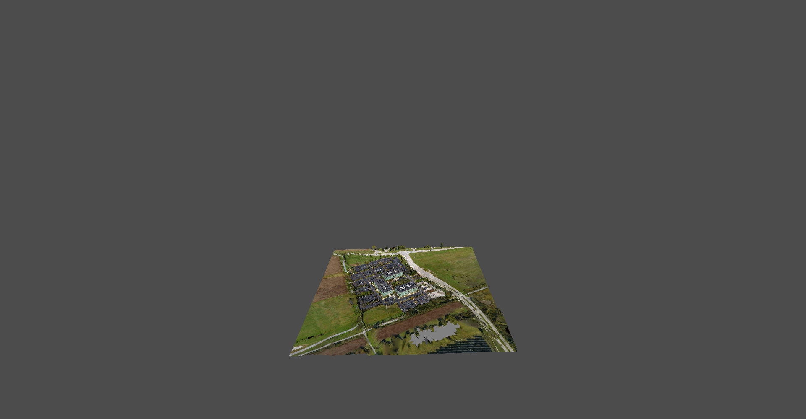

# godot-3dtiles

A Godot 4.7 GDExtension that loads and renders [OGC 3D Tiles](https://github.com/CesiumGS/3d-tiles) directly — **no Cesium dependency**.

The plugin is a self-contained C++20 implementation: an engine-agnostic scheduling kernel plus a thin Godot layer. It reads `tileset.json`, walks the tile tree with screen-space-error refinement, fetches `b3dm` payloads, decodes Draco-compressed meshes and assembles them into Godot nodes.



## Scope

**Built for a single dataset over a small area** — a city block, a quarry, a plant, a district. This is what the large majority of digital-twin projects actually need: one photogrammetry or BIM tileset as the scene's subject, with business layers on top.

This is **not** a digital globe. The main branch does not ship `Globe3D`, and does not handle multi-dataset global layouts, Origin Shift, or ellipsoid-accurate terrain. If you need those, the `feat/globe` branch has a working base implementation (ellipsoid surface + imagery quadtree + orbit camera) sharing the same `src/core/` kernel.

Explicitly out of scope: `pnts` / `i3dm` / `cmpt`, the 3D Tiles styling engine, and global-priority request scheduling.

See **[docs/ARCHITECTURE.md](docs/ARCHITECTURE.md)** for the architecture, coordinate/frame conventions, build instructions and a pitfall list worth reading before changing anything near transforms.

## Status

Working end to end. Verified against 18 datasets covering 3D Tiles 1.0 and 1.1, photogrammetry, b3dm, implicit tiling (quadtree and octree), Draco, and KTX2/Basis textures: **zero engine errors, zero failed loads.**

This project does **not** use `cesium-native` or any Cesium code. It is an independent implementation of the 3D Tiles specification. (See [Credits](#credits) for the reference implementation used to pin down traversal semantics.)

## Registered nodes

| Node | Purpose |
|---|---|
| `Tileset3D` | Loads a `tileset.json`, runs the traversal/load scheduler. Exposes the tile bounding boxes as a depth-coloured wireframe for debugging |
| `Georeference3D` | Defines the render frame. Its transform carries the Z-up (tile) to Y-up (Godot) conversion |
| `Godot3DTiles` | Version/build information |
| `LongitudeLatitudeHeight` | Geodetic origin authority |
| `EarthCenteredEarthFixed` | ECEF origin authority |

## Architecture

```
src/core/    engine-agnostic kernel (static library tiles3d_core)
             tiles, tileset.json parsing, math (double precision),
             b3dm parsing, glTF reading, Draco decoding, KTX2 decoding
             -> must NOT include godot_cpp/* : the kernel is unit tested
                without an engine and must never touch Godot API from a
                worker thread
src/         Godot layer: nodes, content assembly (ArrayMesh +
             StandardMaterial3D + ImageTexture), double->float conversion
```

The kernel works in `double` throughout. Godot's `real_t` is `float`, which at ECEF magnitudes (~6.4e6 m) has a resolution of about half a metre — enough to visibly scatter photogrammetry data. Each dataset is therefore placed in its own local ENU frame, and `src/GodotMathConvert.h` is the single place where narrowing happens.

Traversal follows the REPLACE refinement rules, including the non-obvious ones: a parent keeps rendering to cover holes while a child's content is still loading, and `requestContent` is only issued when refinement stops or for children being refined — so the root tile's payload is typically never fetched when the camera is close.

## Requirements

- **Godot 4.7.2** (standard build)
- **CMake** 3.22+
- A C++20 compiler — on Windows, MSVC (tested with VS 2022)
- **Ninja** (the presets are single-config Ninja)
- **Python** 3.x (used by the godot-cpp binding generator)
- (Optional) **ccache**, **clang-format**

## Dependencies

| Dependency | How it is obtained |
|---|---|
| [godot-cpp](https://github.com/godotengine/godot-cpp) `10.0.0-stable` | git submodule at `extern/godot-cpp` |
| [GLM](https://github.com/g-truc/glm) 1.0.1 | fetched at configure time |
| [nlohmann/json](https://github.com/nlohmann/json) v3.11.3 | fetched at configure time |
| [Google Draco](https://github.com/google/draco) 1.5.7 | **vendored** in `extern/third_party/draco` (trimmed, Apache-2.0) |
| [Basis Universal](https://github.com/BinomialLLC/basis_universal) transcoder + zstd 1.5.7 | **vendored** in `extern/third_party/basisu` |
| [doctest](https://github.com/doctest/doctest) v2.4.11 | fetched at configure time, tests only |

### Why Draco and Basis are bundled

Every tileset produced by the Cesium ion tiling pipeline uses `KHR_draco_mesh_compression`, and Godot's core glTF importer does not implement that extension ([godot#73738](https://github.com/godotengine/godot/issues/73738)). It is not a build flag or an editor/runtime difference — the decoder has to ship with the plugin.

3D Tiles 1.1 goes further: its glb payloads require `KHR_texture_basisu` with `image/ktx2` images, and Godot 4.7's C++ bindings expose no KTX2 decoder at all (`image.hpp` only has `load_ktx_from_buffer`, which is KTX1). The transcoder therefore ships with the plugin too, and images are converted to RGBA8 before they ever reach Godot.

Both are vendored rather than fetched because they are native libraries and the build machine may have no network access.

Build-time pitfalls with these two (non-obvious CMake and initialisation requirements) are documented in [docs/ARCHITECTURE.md](docs/ARCHITECTURE.md), section 6.6.

## Getting started

### Clone

```bash
git clone --recurse-submodules https://github.com/weixu2015/godot-3dtiles.git
```

If you forgot `--recurse-submodules`:

```bash
git submodule update --init --recursive
```

### Build (Windows / MSVC)

```bat
scripts\configure_debug.bat
scripts\debug_build_install.bat
```

`scripts\msvc_env.bat` locates Visual Studio via `vswhere` and activates the MSVC environment, so run the scripts from a plain terminal. In a restricted environment where `reg.exe` is blocked, use `scripts\sandbox_msvc_env.bat` instead — it sets the toolchain paths by hand.

For a release build use `configure_release.bat` / `release_build_install.bat`.

### Build (any platform, via presets)

```bash
cmake --preset windows-editor
cmake --build --preset windows-editor --parallel
cmake --install build/windows-editor
```

Available presets: `windows-editor`, `windows-release`, `linux-editor`, `linux-release`, `macOS-editor`, `macOS-release`. Windows is the actively developed and tested path.

The install step writes the extension and its library to **`demo/addons`**, which is where the bundled `demo` project loads it from — so opening `demo/` in the editor picks up the freshly built plugin.

### Run the tests

```bash
ctest --preset windows-editor
```

Note: `test_gltf_reader.cpp` has 6 long-standing failures, unrelated to current functionality. Compare against that baseline rather than expecting a clean run.

### Debugging in Visual Studio

1. Right-click the project and select `Properties`.
2. Set the debugging parameters:
   - **Command**: `${YourGodotEngineExePathIncludeFileName}`
   - **Command Arguments**: `-e --path ${YourGodotProjectDirectoryPath}`

## Credits

- Based on the GDExtension [template](https://github.com/asmaloney/GDExtensionTemplate) for CMake.
- Traversal and LOD semantics were derived from a production Three.js 3D Tiles scheduler; where Cesium's and that implementation's behaviour diverge, the latter is treated as the reference.
- Bundles [Google Draco](https://github.com/google/draco) (Apache-2.0).
- Bundles the [Basis Universal](https://github.com/BinomialLLC/basis_universal) transcoder and [zstd](https://github.com/facebook/zstd).

